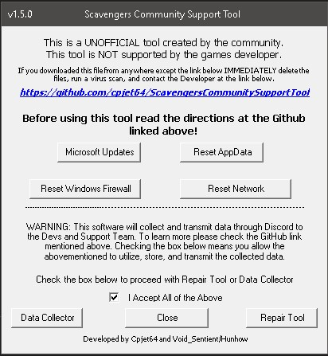

 
  

  &#xa0;

  <!-- <a href="https://scavengersue4supporttool.netlify.app">Demo</a> -->

<h1 align="center">Scavengers Community Support Tool</h1>

 <!--  -->

 <!--  -->

  

  

  

  

  

<!-- Status -->

<!-- <h4 align="center"> 
	🚧  ScavengersUE4SupportTool 🚀 Under construction...  🚧
</h4> 

 -->

  <a href="#about">About</a> &#xa0; | &#xa0; 
  <a href="#antivirus">Antivirus</a> &#xa0; | &#xa0; 
  <a href="#features">Features</a> &#xa0; | &#xa0;
  <a href="#release">Download</a> &#xa0; | &#xa0;
  <a href="#requirements">Requirements</a> &#xa0; | &#xa0;
  <a href="#usage">How To Use</a> &#xa0; | &#xa0;
  <a href="#what and where">What and Where</a> &#xa0; | &#xa0;
  <a href="#privacy">Privacy</a> &#xa0; | &#xa0;
  <a href="#license">License</a> &#xa0; | &#xa0;
  <a href="#credits">Credits</a>

 

## About ##

This software is free and open source. This software is designed to help people having crashing or performance issues with the game Scavengers. If you have any questions or suggestions, please contact Cpjet64#5663 via Discord.

If you were helped by this software please make sure to Star this repository in the top right corner of the page! 

<a href="#top">Return to Top</a>

## Antivirus ##
**False Positive Alert**  
Due to the way I am packaging the Community Support Tool some AntiVirus software will flag it as malicious even though its not.
If your antivirus flags it you will have to either disable your antivirus temporarily to use the tool or allow the ScavengersCST.exe as a exception. 
The entire source of the tool is available in this repository I encourage everyone to read through it if you have concerns. The only part of the source that is not publicly available for obvious reasons is the API Keys which are housed in seperate resource file.
As long as you download the tool directly from this github page you are fine. 
I encourage you to compare the filehashes I generate when I package the tool to verify their authenticity the hashes are located with the releases.   

In order to help you do this I have included the hash generating script I use named hashandrelease.ps1.  

**If you downloaded the tool from anywhere other than here please immediately delete it run a virus scan and contact Cpjet64#5663 via Discord.**

<a href="#top">Return to Top</a>

## Release ##

Download the latest release from https://github.com/cpjet64/ScavengersUE4SupportTool/releases/latest

<a href="#top">Return to Top</a>

## Features ##

 There are currently six different uses for the tool. Microsoft Updates, Reset AppData, Reset Windows Firewall, Reset Network, Data Collector, and Repair.
 * **Microsoft Updates** button will download and install all available Microsoft Updates excluding Update Previews and will gather what updates were installed and send it directly to the Official Scavengers Discord for the support team and developers to analyze.
 * **Reset AppData** button will rename the Scavenger folder located in your localappdata folder. This folder contains the graphics and game settings and cache for the game.  This button does not transmit data to Discord.
 * **Reset Windows Firewall** button will reset your Windows Firewall to the DEFAULT settings. This button does not transmit data to Discord.
 * **Reset Network** button will perform a full reset of your network adapters.  This button does not transmit data to Discord.
 * **Data Collection** button will gather basic system data listed at the end of this readme and send it directly to the Official Scavengers Discord for the support team and developers to analyze.
 * **Repair** button will run several included with Windows repair programs and update your Visual C++ and DirectX redistributables and will also gather basic system data listed at the end of this readme and send it directly to the Official Scavengers Discord for the support team and developers to analyze.

 <a href="#top">Return to Top</a>

## Requirements ##

Before starting you must ensure you have installed the latest Windows Updates to include Cumulative and Optional updates.

<a href="#top">Return to Top</a>

## Usage ##

 1. Start the ScavengersCST.exe file, you will be presented with a User Account Control (UAC) popup asking if you want to allow the program to make changes to your computer. Make sure to select YES.
 2.  Please read the text displayed on the graphical interface and click the checkbox accepting the terms.

 
 3. Click the button that you were told to click by the Support Team.
    * If you selected Data Collection or Repair please enter your full Discord name including the numbers like `ScavengersGamer#1234` The Support Team and/or Devs will use this discord name to contact you in the event they need more information.
    * While the tool is running the buttons will grey out to prevent you from clicking on them but please make sure NOT TO touch your keyboard or click anything with your mouse.  

**_If you accidentally click into the console window that pops up it will lock up the tool until you click in the console again and press your "Enter" key._**
 
 4. Wait for the tool to finish. 
    * Please note if you clicked the Repair button **_your computer will automatically restart after you click OK_** when the tool is finished.

<a href="#top">Return to Top</a>

## What and Where ##

#### This tool will create the following files on your computer:  
(These files are created and deleted automatically)  

%localappdata%\Temp\SCSTInfo.log  
(This file contains the PC information)  

%localappdata%\Temp\SCSTRepair.log  
(This file contains the PC information and the repair tool logs)

%userprofile%\desktop\MSUpdates.log  
(This file contains the updates that you downloaded/installed and it does not delete automatically for your own records)

#### This tool will download and install the following files on your computer:  

(Not including the parts of Windows that will be automatically installed by Windows to allow you to run the tool if they are missing)  
(The downloaded installers will be deleted automatically once they are done runnning)  
<a href="https://download.microsoft.com/download/8/4/A/84A35BF1-DAFE-4AE8-82AF-AD2AE20B6B14/directx_Jun2010_redist.exe" target="_blank">DirectX Redistributable from Microsoft</a>  
<a href="https://aka.ms/vs/16/release/vc_redist.x86.exe" target="_blank">Visual C++ 32Bit x86 Redistributable from Microsoft</a>  
<a href="https://aka.ms/vs/16/release/vc_redist.x64.exe" target="_blank">Visual C++ 64bit x64 Redistributable from Microsoft</a>  
<a href="https://docs.microsoft.com/en-us/powershell/module/packagemanagement/install-packageprovider?view=powershell-7.1#example-2--install-a-specified-version-of-a-package-provider" target="_blank">Nuget Package Provider</a>  This is for downloading Microsoft Updates  
<a href="https://www.powershellgallery.com/packages/PSWindowsUpdate/2.2.0.2" target="_blank">PSWindowsUpdate</a>  This is also for downloading Microsoft Updates

<a href="#top">Return to Top</a>

## Privacy ##

This tool will collect the following data and transmit it automatically upon completion of running either the Data Collector or Repair functions.   
This data will be transmitted via Discord to the Developers and Support Team of Scavengers Game.   
This data will be used to assist with troubleshooting and repairing PC issues.   
If you would like to request a copy of the data transmitted please contact one of the  
Moderation Staff in the Official Discord of Scavengers and provide the Discord username you used when the tool requested it.

#### Data collected:  
CPU - Name, MaxClockSpeed, SocketDesignation, Manufacturer  
GPU - Name, CurrentHorizontalResolution, CurrentVerticalResolution, CurrentRefreshRate, AdapterRam, DriverDate, DriverVersion  
RAM/MEMORY - Manufacturer, PartNumber, Speed, DeviceLocator  
Disk Drive - DeviceID, Model (To translate, this collects the model number and which physical drive it is)  
Logial Disk/Partition - DeviceID (To translate, this collects the partitions for example the C:\ drive or the D:\ drive and how many GB the size is)  
SFC Tool Logfile - This tool collates the repair information from the CBS.log file which is generated when the SFC Tool is run  
DISM Tool Logfile - This tool collates the repair information from the custom DISM logfile which is generated when the DISM Tool is run  

<a href="#top">Return to Top</a>

## License ##

This project is under license GNU GPLv3. For more details, see the [LICENSE](LICENSE.md) file.

<a href="#top">Return to Top</a>

## Credits ##

Made with :heart: by <a href="https://github.com/cpjet64" target="_blank">cpjet64</a> and <a href="https://github.com/VoidSentient" target="_blank">VoidSentient</a>
&#xa0;

<a href="#top">Return to Top</a>
